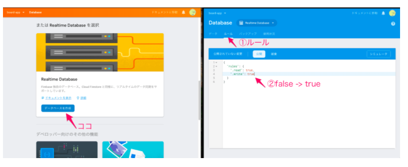

# firebaseリアルタイムDBを活用する
Firebase Realtime Database はクラウドホスト型データベースです。データは JSON として保存され、接続されているすべてのクライアントとリアルタイムで同期されます。  
Firebase Realtime Database は、一般的な HTTP リクエストではなくデータ同期を使用します。データが変更されるたびに、接続されているあらゆるデバイスがその更新を数ミリ秒以内に受信します。

## スニペットの取得


画像の加工部分が実際にリアルタイムDBを作成する際に必要になるので控えて置いてください。

## リアルタイムDBの作成
では登録したfirebaseの情報を変更していきます。  
データベースを作成後、読み込み書き込みを許可するためにルールで
```vue
”.read”: false, => “.read”: true,
“.write”: false => “.write”: true
```
に変更します。


