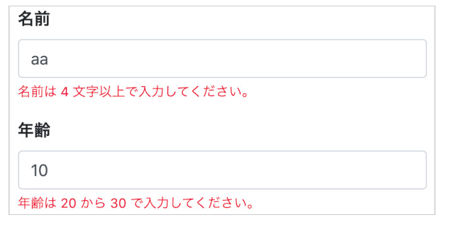

# バリデーション
バリデーションの実装には、vuelidate を利用します。

## バリデーションの実装
まずはvuelidateをインストールします。
```vue
$ npm i vuelidate
```
つぎに、Vuelidateの基本的な設定を行いましょう。Vuelidateのライブラリは、つぎのようにふたつCDNから<script>要素に読み込みます。
```vue
<script src="https://cdn.jsdelivr.net/npm/vuelidate@0.7.4/dist/vuelidate.min.js"></script>
<script src="https://cdn.jsdelivr.net/npm/vuelidate@0.7.4/dist/validators.min.js"></script>
```
Vuelidateにより使えるようになるのは、つぎのふたつの機能です。
  
- validationsコンポーネントオプション
Vueコンポーネントに検証の中身を定めます。
- `$v`モデルオブジェクト
Vueのモデルと検証の状態をプロパティとしてもつモデルのオブジェクトです。
validationsオプションプロパティはVueインスタンスのオプションオブジェクトに加えて、検証するデータに対して何を確かめるのかオブジェクトで定めます。プロパティが検証するデータ、値はバリデータ(検証の設定)を納めたオブジェクトです。Vue.use()メソッドでVuelidateを使い、用いるバリデータはvalidatorsから変数に取り出しておいてください。requiredは入力が必須ということです。

### 使用例
フォームにバリデーションを実装
```vue
<template>
  <div class="container">
    <div class="row">
      <div class="col-12">
        <form>
          <div class="form-group">
            <label>名前</label>
            <input type="text" class="form-control" v-model.trim="$v.name.$model" />
            <div class="invalid-feedback d-block" v-if="!$v.name.required">名前を入力してください。</div>
            <div
              class="invalid-feedback d-block"
              v-if="!$v.name.minLength"
            >名前は {{$v.name.$params.minLength.min}} 文字以上で入力してください。</div>
          </div>
          <div class="form-group">
            <label>年齢</label>
            <input type="number" class="form-control" v-model.trim="$v.age.$model" />
            <div
              class="invalid-feedback d-block"
              v-if="!$v.age.between"
            >年齢は {{$v.age.$params.between.min}} から {{$v.age.$params.between.max}} で入力してください。</div>
          </div>
        </form>
      </div>
    </div>
  </div>
</template>

<script>
import { required, minLength, between } from "vuelidate/lib/validators";
export default {
  data() {
    return {
      name: "",
      age: 0
    };
  },
  validations: {
    name: {
      required,
      minLength: minLength(4)
    },
    age: {
      between: between(20, 30)
    }
  }
};
</script>
```
このように validations オプションに各keyのバリデーションを設定することで、簡単にバリデーションを実装できます。  



[公式](https://vuelidate.js.org/#sub-installation)


## カスタムルールの実装
TODO date にカスタムルールを入れる
カスタムルールとはjavascriptを使い自分で


## バリデーションルールの分離
TODO service/validations.js を作成してルールを分離する。
