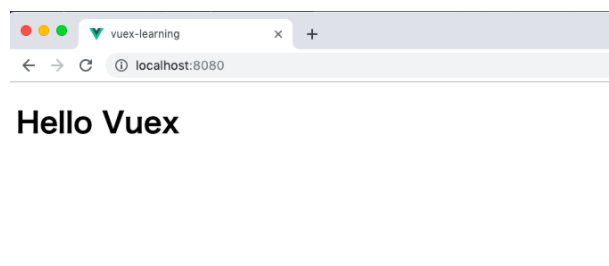

# Vuex の利用
今回のアプリケーションでは、 投稿画面と一覧画面を行き来するたびに、 firebase への通信が発生しています。
一度取得したデータをアプリケーション内で保持したり、 ページ間でデータを共有したりするようなケースでは、 Vuex を用いたデータ管理が非常に便利です。
Nuxt.js ではデフォルトで Vuex の利用準備が整っているため、 store フォルダにファイルを配置するだけで簡単に Vuex Store モジュールを作成できます。
[公式ドキュメント](https://vuex.vuejs.org/ja/)

## Vuex Store モジュールの作成
今回、タスクのデータを利用するため、 `store/tasks.js` ファイルを作成して、Vuex Store モジュールとして展開します。
`state` は Vuex Store モジュール内で管理するオブジェクトの定義です。 ここでは、タスクデータとして items を配列で定義しています。  
EX) stateの定義
```vue
const store = new Vuex.Store({
  // ステートを定義する
  state: {
    login: false
  }
})

console.log(store.state.login) // falseが表示されます
```
ステートを定義するには、上記のようにストアの生成時にstateオプションを指定して、その中に管理したい情報を定義します。今回の場合は、loginという情報を定義しました。

mutations は state に対する操作パターンの定義です。 投稿画面からデータを追加する際に利用する ADD_TASK と firebase から一覧データを取得した際に利用する LOAD_TASKSを定義しています。  
また、VuexのStateを変更する唯一の方法はMutationをコミットすることです。
EX 
```vue
const store = new Vuex.Store({
  state: {
    count: 1
  },
  mutations: {
    increment (state) {
      // 状態を変更する
      state.count++
    }
  }
})
```
Mutationはイベントに近い概念を持っており`タイプ`と`ハンドラ`を持ちます。  
例えば上記のコードではincrementがタイプで、メソッド部分を含めるとハンドラになります。
Mutationは直接呼び出すことはできず下記のようにミューテーションタイプを指定しコミットすることになります。
```vue
store.commit('increment')
```
actions は実際にアプリケーション内部で利用する、 Vuex Store モジュールへのデータ操作関数の定義です。
プラグイン経由でinject した $fb は Vuex Store モジュール内でも参照できるので、 ここで $fb を用いて firebase へのアクセスを行なっています。  

アクションはミューテーションと似ていますが、下記の点で異なります:  
- アクションは、状態を変更するのではなく、ミューテーションをコミットします。
- アクションは任意の非同期処理を含むことができます。


## vue ファイルからの Vuex の利用
vue ファイルから Vuex を参照する、一番簡単な手法は $store を利用する方法です。
以下の例を見ていきましょう。
store/index.js
```vue
import Vue from 'vue'
import Vuex from 'vuex'

Vue.use(Vuex)

export default new Vuex.Store({
  state: {
  	message: 'Hello Vuex'
  },
  mutations: {
  },
  actions: {
  }
  modules: {
  }
})
```
.vueファイル
```vue
<template>
  <div id="app">
    <h1>{{ $store.state.message }}</h1>
  </div>
</template>
```
表示結果


上記の例は、$store.state.messageと少し長いですが、$storeという大きな入れ物の中にさらにstateという入れ物があり、その中にmessageが入っているイメージを持つことができます。

## mapper の活用
$store 利用せずとも、Vuex で提供されている mapper を利用して、 シンプルに Vuex の参照を行うことも可能です。Vuex の利用
