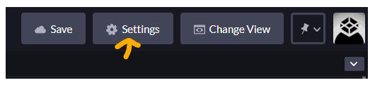
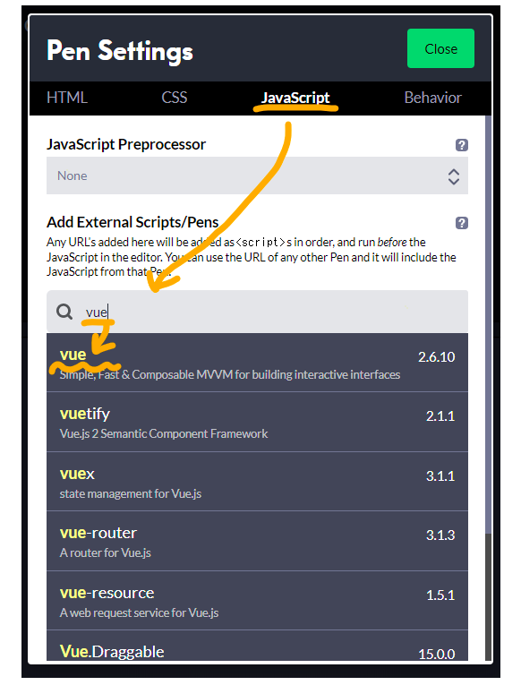

# Codepen で Vue.js を記述する方法
まずcodepenを開いて「pen」を押して新しく作成してください。  
[codepenリンク](https://codepen.io/popular/pens)

次に画面右上の`Settings`を選択します


ダイアログが表示されたら、JavaScriptタブを選択し、Search CDNjs欄にvueと入力します。
するとリストにvueが表示されますので選択します。選択が終わったらSave & Closeを押して設定を保存します。



## クラスとスタイルのバッティングについての注意
注意として、クラスとスタイルのバインディングの際にクラス名などにハイフンが含まれている場合、それらを指定する時は下のようにシングルクォーテーションで囲む必要があります。  
注意しながら記述して行きましょう。
```vue
:class="{ 'is-active': isActive }"
```
