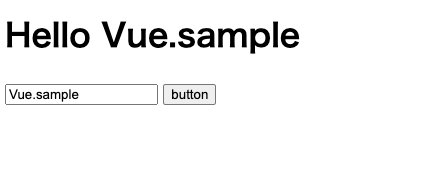

# Codepen で Vue.js を記述する方法
まずcodepenを開いて「pen」を押して新しく作成してください。  
[codepenリンク](https://codepen.io/popular/pens)

次に画面右上の`Settings`を選択します


ダイアログが表示されたら、JavaScriptタブを選択し、Search CDNjs欄にvueと入力します。
するとリストにvueが表示されますので選択します。選択が終わったらSave & Closeを押して設定を保存します。


## クラスとスタイルのバッティングについての注意
注意として、クラスとスタイルのバインディングの際にクラス名などにハイフンが含まれている場合、それらを指定する時は下のようにシングルクォーテーションで囲む必要があります。  
注意しながら記述して行きましょう。
```vue
:class="{ 'is-active': isActive }"
```

## Vue.jsを使った例

まずCodePenの「HTML」の入力箇所に以下を入力します。Vue.jsで書いたコードのレンダリング先となります。
```html
<div id="content">
  <my-component></my-component>
</div>
```
CodePenの「JS」の入力箇所に以下を入力します。ただ単にHello Worldを出力するだけだと面白くないので、テキストフィールドを用意し、入力したテキストをボタンを押したタイミングで、「Hello」の後に表示するようなものとしました。  
コードの書き方はReact風なデータフローとなるような書き方で書いています。一応、Vueの特徴でもある双方向データバインディングやカスタムイベントなどを使用してみました。
```javascript
/**
 * 子コンポーネント1
 * 入力されたテキストを表示するコンポーネント
 */
const VueCompChild1 = {
  props: ['message'],
  template: `<h1>Hello {{ message }}</h1>`,
};

/**
 * 子コンポーネント2
 * テキストを入力するためのコンポーネント
 */
const VueCompChild2 = {
  props: ['inputValue'],
  methods: {
    handleInput($event) {
      this.$emit('input', $event.target.value);
    }
  },
  template: `<input type="text" v-bind:value="inputValue" v-on:input="handleInput($event)" />`,
}

/**
 * 子コンポーネント3
 * 入力されたテキストを表示させるボタンコンポーネント
 */
const VueCompChild3 = {
  methods: {
    handleClick($event) {
      this.$emit('clickButton', $event);
    }
  },
  template: `<button v-on:click="handleClick('click')">button</button>`,
};

/**
 * 親コンポーネント
 */
Vue.component('my-component', {
  data() {
    return {
      value: 'Vue',
      inputValue: '',
    };
  },
  methods: {
    handleClickButton($event) {
      console.log($event);
      this.value = this.inputValue;
      this.inputValue = '';
    },
  },
  components: {
    'vue-comp-child1': VueCompChild1,
    'vue-comp-child2': VueCompChild2,
    'vue-comp-child3': VueCompChild3,
  },
  template: `
    <div>
      <vue-comp-child1 v-bind:message="value"></vue-comp-child1>
      <vue-comp-child2 v-model="inputValue"></vue-comp-child2>
      <vue-comp-child3 v-on:clickButton="handleClickButton"></vue-comp-child3>
    </div>
  `,
});

/**
 * DOMに出力（Bootstrapping）
 */
new Vue({
  el: '#content',
});
```
これでフォームに何か入力してbuttonを押せば「Hello Vue.sample」のように表示されます。

