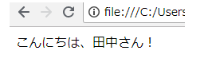
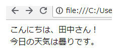
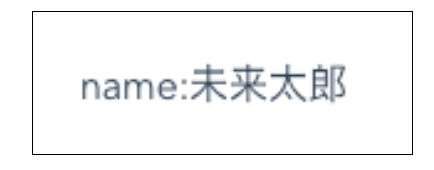

# コンポーネントスロットの活用

## コンポーネントスロットとは
slotとは親となるコンポーネント側から、子のコンポーネントのテンプレートの一部を差し込む機能 です。  
スロットというと「スロットマシン」が思い浮かびますが、もともとslotの「差し込み口」という意味から派生して、コインの投入口があるスロットマシンの意味をもつようになったそうです。

## 各スロットについて
大きく3つ、デフォルトのslot、名前付きslot、スコープ付きslotについて、説明していきます。

### デフォルトスロット
template内で、slotというタグを使うことで、リアクティブデータを、コンポーネントのテンプレートの中に差し込んでいます。
  
```vue
<div>
  <slot-test>ここに値を入れれます。  EX) 田中 </slot-test>
</div>
```
```vue
<script>
Vue.component('slot-test', {
     template: '<div>こんにちは、<slot>xxx</slot>さん！</div>'
 });
</script>
```

「<slot-test>田中</slot-test>」としている「田中」の部分は「デフォルトスロット」といい、コンポーネント側の`<slot><slot>`の位置に自動で出力されます。
- 実行結果
  


### 名前付きスロット
複数のslotを利用したい場合には、異なる名前をつけて利用します。
Vue 2.6.0以降は、コンポーネント側では、`<slot name = "XXX">`で名前付きslotを定義します。    
また、v-bind を 「:」、v-onを「@」で省略できるように、v-slotも「#」で省略して記述することができます。

```vue
<div id="app">
    <slot-test>
      <span slot="login">田中</span>
      <span #footer>今日の天気は曇りです。</span>
    </slot-test>
</div>
```
```vue
<script >
Vue.component('slot-test', {
    template: '<div>'+
              '<div>こんにちは、<slot name="login">xxx</slot>さん！</div>'+
              '<footer><slot name="footer"></slot></footer>'+
              '</div>'
});
</script>
```

呼び出し元には、「slot=”呼び出すスロット名”」、呼び出し先には「name=”スロット名”」という形で定義をすることで、それぞれ色んな場所に埋め込むことが可能です。
- 実行結果  


### スコープ付きスロット
スコープ付きslotを利用することで、子コンポーネントから親コンポーネントに対して、スロットコンテンツの定義に必要なデータを受け取ることが可能です。

スコープ付きslotを利用するには、子コンポーネント側では、<slot>タグに対してv-bindを行います。


```vue
<template>
   <div class="home">
     <MyCom>
       {{ userNm.jpName }}
     </MyCom>
   </div>
 </template>
 <script>
 import MyCom from '../components/MyCom.vue'
 export default {
   components: {
     MyCom
   }
 }
 </script>
```
```vue
<template>
   <div class="mycom">
     <p>name:<slot :userNm="userNm">{{ useNm.enName }}</slot></p>
   </div>
 </template>
 <script>
 export default {
   name: 'MyCom',
   data () {
     return {
       userNm: {
         enName: 'Mirai Taro',
         jpName: '未来太郎' // ←slot内で参照したいデータ
       }
     }
   }
 }
 </script>
```

親側では<v-slot:default>で受け取ることで、子コンポーネントのjpNameの値をとることができます。<v-slot:default="slotProps">のslotPropsは任意ですので重複がなければ、どんな文字列でも構いません。（公式ドキュメントに合わせました。）


なお、名前付きslotを併用する場合、defaultの部分はそれぞれのslotの名前となります。
slotに名前が設定されていない時のデフォルトの名前がdefaultになるということです。

- 実行結果  


